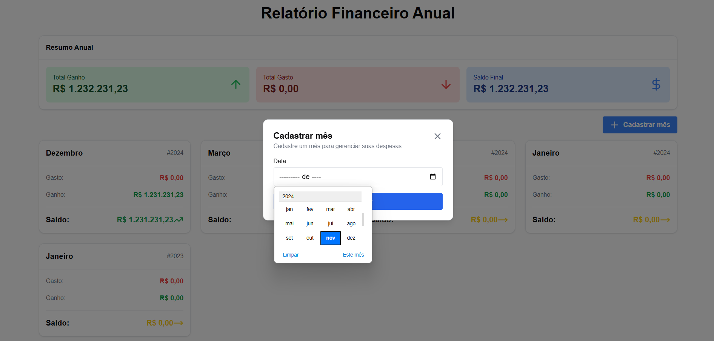
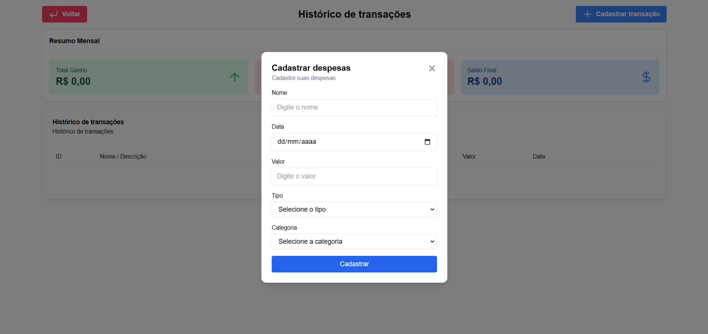

# Finances App
Nesse projeto desenvolvemos um site para gestão financeira própria, onde podemos cadastrar entradas e saídas de transações financeiras como salários, alimentações, lazer etc...
Desenvolvemos o site em HTML, Tailwind CSS, PHP e SQL conforme solicitado pelo professor Valdir. Realizamos o site de uma forma que ele ficasse responsivo em todos os dispositivos como PC, celular, tablet, etc...

Segue os prints das telas:

Faculdade: UNIMAR

Curso: Analise e desenvolvimento de sistema

Disciplina: Desenvolvimento Web

## Screenshots

## Autores

- Igor Enzo da Silva Kita 1992614 (https://github.com/igorkita)

- Leonardo Balbo de Oliveira 2009203 (https://github.com/leobalbo)

## Demonstração

[Assista o vídeo de demonstração](https://www.youtube.com/watch?v=6M0CT6v9s6E)